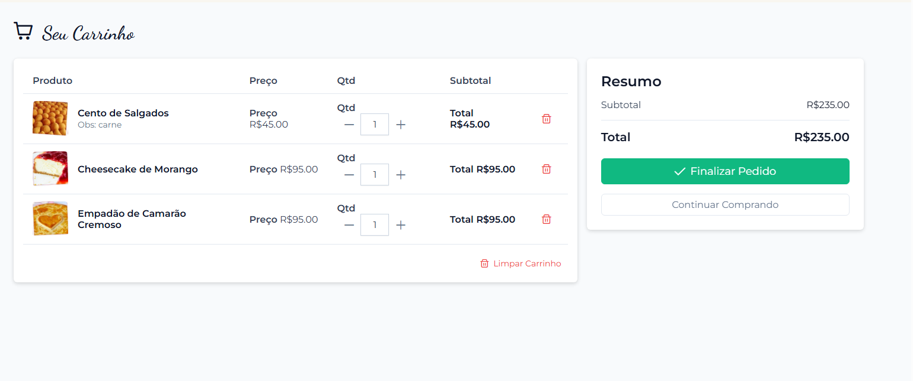
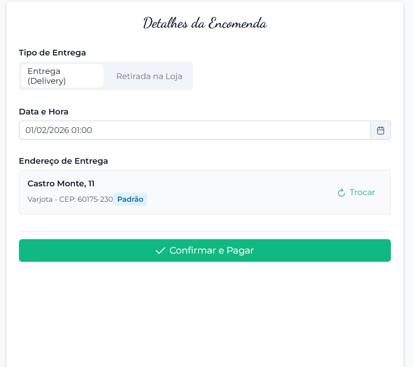
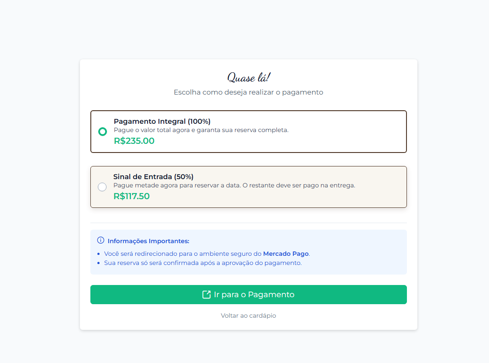
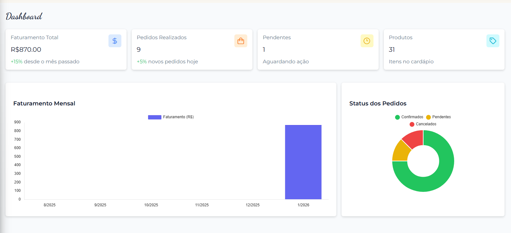
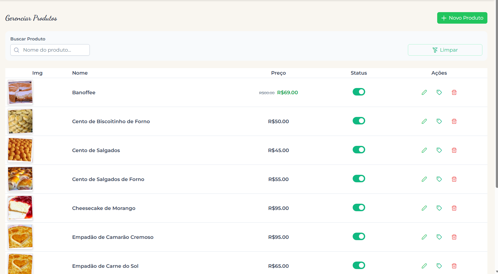
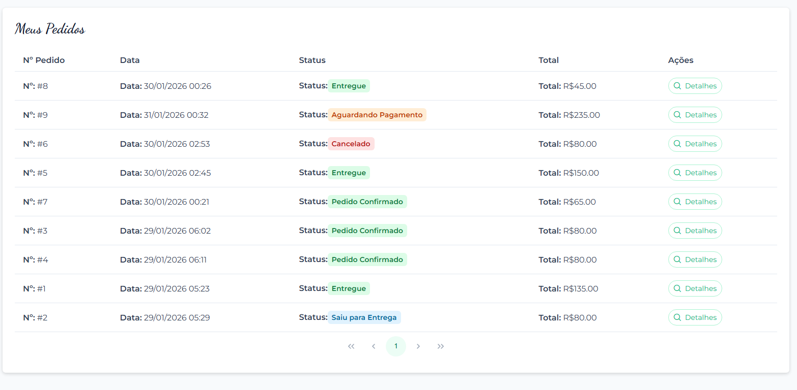
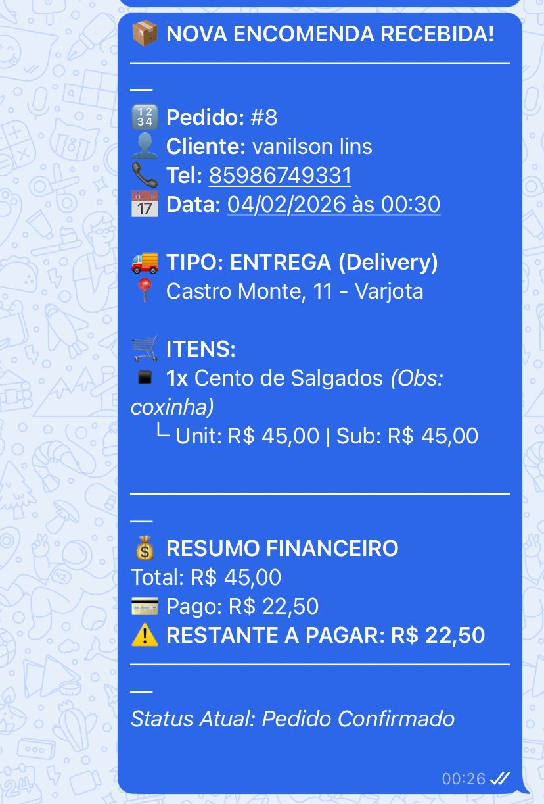

# 🥐 A Nossa Padaria
### Sistema de Gestão de Encomendas Full-Stack

 

> Um sistema robusto para gestão de encomendas personalizadas (Confeitaria/Padaria), integrando **E-commerce para o cliente** e **Dashboard Administrativo** para gestão da produção em tempo real.

[Ver Demo Online](https://np-order.vercel.app/) • [Documentação da API](https://backend-api-tk7o.onrender.com/swagger) • [Reportar Bug](https://github.com/SEU_USUARIO/SEU_REPO/issues)

---

## 🚀 Live Demo

| Aplicação | Link de Acesso | Hospedagem | Status |
|-----------|----------------|------------|--------|
| **Frontend (App)** | [np-order.vercel.app](https://np-order.vercel.app/) | **Vercel** |  |
| **Backend (API)** | [backend-api.onrender.com](https://backend-api-tk7o.onrender.com/swagger) | **Render** |  |

---

## 🛠️ Tecnologias Utilizadas

### Frontend (Client & Admin)
* **Framework:** Angular 19 (Standalone Components, Signals, Control Flow).
* **UI/UX:** PrimeNG (Tema Aura) + TailwindCSS.
* **Autenticação:** `angular-auth-oidc-client` (PKCE Flow).
* **Gestão de Estado:** Services reativos com RxJS e Signals.

### Backend (API)
* **Framework:** .NET 9 (C#).
* **ORM:** Entity Framework Core.
* **Banco de Dados:** PostgreSQL.
* **Auth:** IdentityServer customizado para gestão de usuários, Claims e Roles.
* **Arquitetura:** Repository Pattern, DTOs, Clean Code.

### DevOps & Integrações
* **Evolution API:** Serviço Dockerizado para envio de mensagens automáticas no WhatsApp.
* **CI/CD:** Deploy automatizado via Vercel (Front) e Render (Back).
* **Docker:** Containerização dos serviços auxiliares.

---

## ✨ Funcionalidades

### 👤 Área do Cliente
- [x] **Catálogo Digital:** Visualização de produtos com imagens, preços e descrições.
- [x] **Carrinho de Compras:** Adição de itens e cálculo de subtotal.
- [x] **Checkout:** Finalização de pedido com escolha de método de entrega.
- [x] **Meus Pedidos:** Rastreamento de status em tempo real (ex: "Em Produção").
- [x] **Notificações:** Recebimento de atualizações via WhatsApp.

### 🛡️ Área Administrativa (Backoffice)
- [x] **Dashboard:** Visão geral de vendas, status de pedidos e métricas financeiras.
- [x] **Gestão de Encomendas:** Kanban para mover pedidos de status (Pendente -> Entregue).
- [x] **Gestão de Produtos:** CRUD completo com upload de imagens e controle de estoque.
- [x] **Controle de Acesso:** Rotas protegidas via Guards (apenas Role `Admin`).

---

## 📸 Screenshots

### 📱 Experiência do Cliente

| Personalização de Item | Carrinho de Compras |
|:---:|:---:|
|  |  |

| Checkout e Endereço | Pagamento |
|:---:|:---:|
|  |  |

### 📊 Painel Administrativo

| Dashboard Financeiro | Gerenciamento de Produtos |
|:---:|:---:|
|  |  |

### 📦 Acompanhamento e Notificações (WhatsApp)

| Histórico de Pedidos (Web) | Notificações em Tempo Real (WhatsApp) |
|:---:|:---:|
|  |   |
---

## 🧪 Como Testar o Projeto

Este projeto está hospedado em ambiente de produção utilizando serviços em nuvem. O backend foi arquitetado em microsserviços e distribuído em 3 instâncias no **Render**:
1. **API Principal** (.NET 9)
2. **IdentityServer** (Serviço de Login)
3. **Evolution API** (Envio de WhatsApp)

> ⚠️ **Aviso Importante (Cold Start):**
> Como os serviços de backend utilizam o **Plano Gratuito do Render**, os servidores entram em **modo de suspensão** após períodos de inatividade.
>
> Ao acessar pela primeira vez, pode haver uma **lentidão de até 50 segundos** enquanto as APIs "acordam". Por favor, aguarde o carregamento ou recarregue a página caso o login falhe na primeira tentativa.

### Passo a Passo para Teste:

1. **Acordar o Serviço de WhatsApp (Opcional):**
   Acesse o link abaixo apenas para garantir que o servidor de mensagens inicie:
   👉 [evolution-api-v2-3-4-lx50.onrender.com](https://evolution-api-v2-3-4-lx50.onrender.com)

2. **Acessar a Aplicação:**
   Acesse o sistema completo através do link abaixo e navegue pelas funcionalidades:
   🚀 [https://np-order.vercel.app](https://np-order.vercel.app)

