

# 🥐 A Nossa Padaria
### Sistema de Gestão de Encomendas Full-Stack

 

> Um sistema robusto para gestão de encomendas personalizadas (Confeitaria/Padaria), integrando **E-commerce para o cliente** e **Dashboard Administrativo** para gestão da produção em tempo real.

[Ver Demo Online](https://np-order.vercel.app/) • [Documentação da API](https://backend-api-tk7o.onrender.com/swagger)

---

## 🚀 Live Demo

| Aplicação | Link de Acesso | Hospedagem | Status |
|-----------|----------------|------------|--------|
| **Frontend (App)** | [np-order.vercel.app](https://np-order.vercel.app/) | **Vercel** |  |
| **Backend (API)** | [backend-api.onrender.com](https://backend-api-tk7o.onrender.com/swagger) | **Render** |  |

---

## 🛠️ Tecnologias Utilizadas

### Frontend (Client & Admin)
* **Framework:** Angular 19.
* **UI/UX:** PrimeNG.
* **Autenticação:** `angular-auth-oidc-client`.
* **Gestão de Estado:** Services reativos com RxJS e Signals.

### Backend (API)
* **Framework:** .NET 9 (C#).
* **ORM:** Entity Framework Core.
* **Banco de Dados:** PostgreSQL.
* **Auth:** Integração em nuvem com Auth0 (SSO, Autenticação Social via Google, gestão de Claims e Roles).
* **Arquitetura:** Repository Pattern, DTOs, Clean Code.

### DevOps & Integrações
* **Evolution API:** Serviço Dockerizado para envio de mensagens automáticas no WhatsApp.
* **CI/CD:** Deploy automatizado via Vercel (Front) e Render (Back).
* **Docker:** Containerização dos serviços auxiliares.

---

## ✨ Funcionalidades

### 👤 Área do Cliente
- [x] **Catálogo Digital:** Visualização de produtos com imagens, preços e descrições.
- [x] **Carrinho de Compras:** Adição de itens e cálculo de subtotal.
- [x] **Checkout:** Finalização de pedido com escolha de método de entrega.
- [x] **Meus Pedidos:** Rastreamento de status em tempo real (ex: "Em Produção").
- [x] **Notificações:** Recebimento de atualizações via WhatsApp.

### 🛡️ Área Administrativa (Backoffice)
- [x] **Dashboard:** Visão geral de vendas, status de pedidos e métricas financeiras.
- [x] **Gestão de Encomendas:** Kanban para mover pedidos de status (Pendente -> Entregue).
- [x] **Gestão de Produtos:** CRUD completo com upload de imagens e controle de estoque.
- [x] **Controle de Acesso:** Rotas protegidas via Guards (apenas Role `Admin`).

---

## 📸 Screenshots

### 📱 Fluxo do Cliente (Compra)

| Cardápio Principal | Detalhes do Produto |
|:---:|:---:|
| 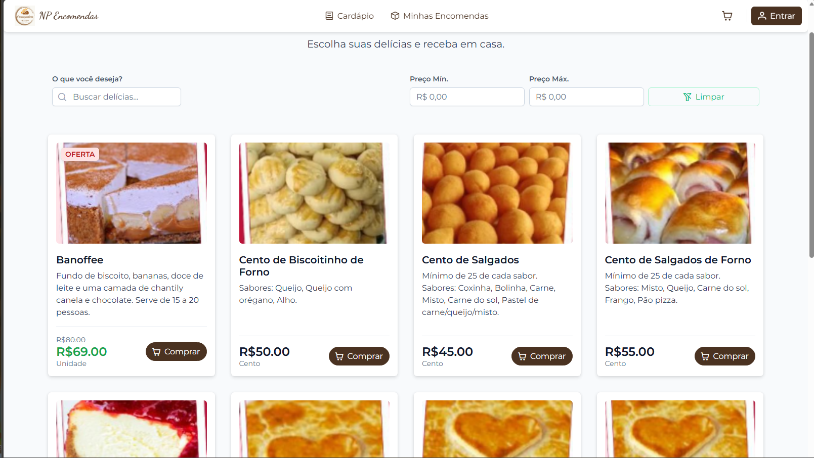 | 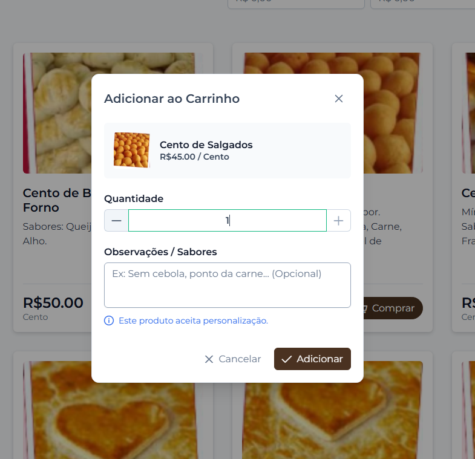 |

| Carrinho de Compras | Checkout & Endereço |
|:---:|:---:|
| 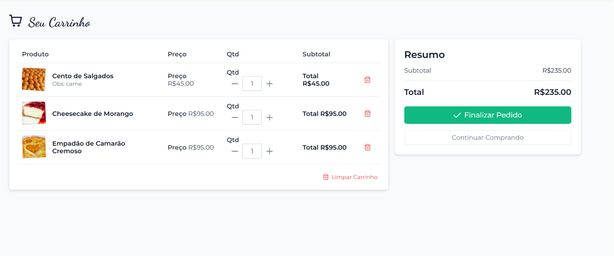 | 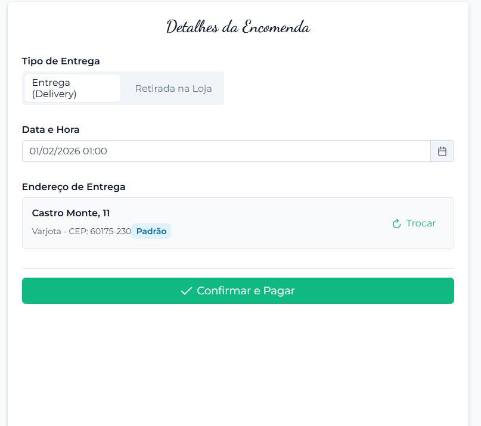 |

| Pagamento | Confirmação e Detalhes |
|:---:|:---:|
| 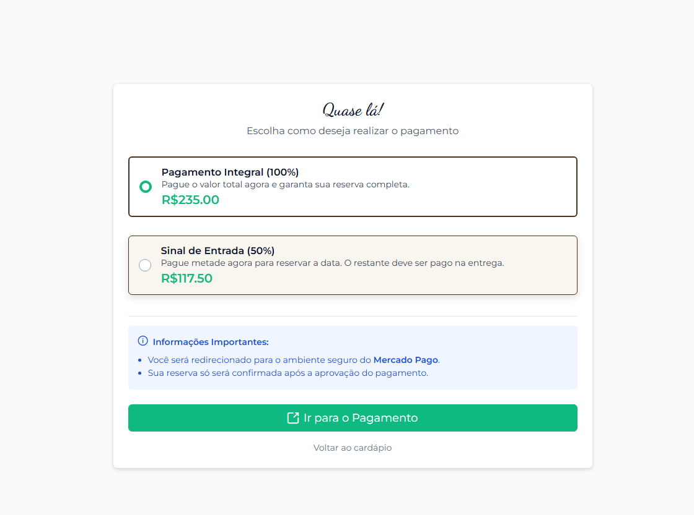 | 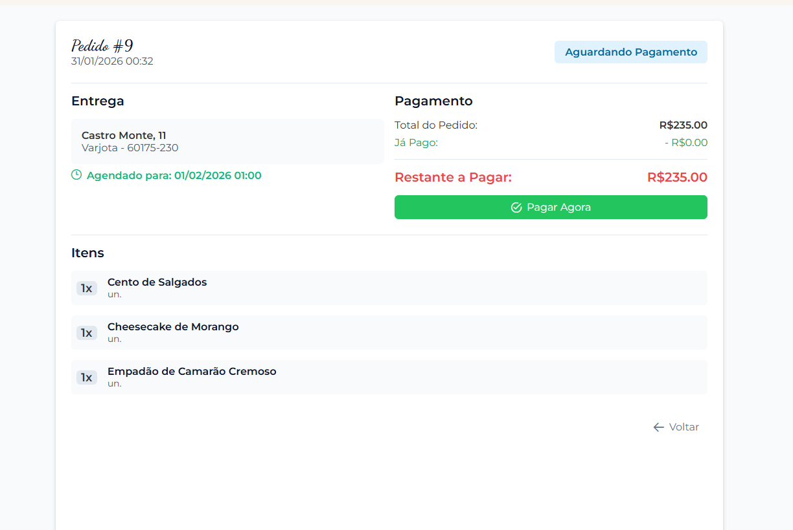 |

### 📊 Painel Administrativo

| Login & Dashboard | Gestão de Produtos |
|:---:|:---:|
| 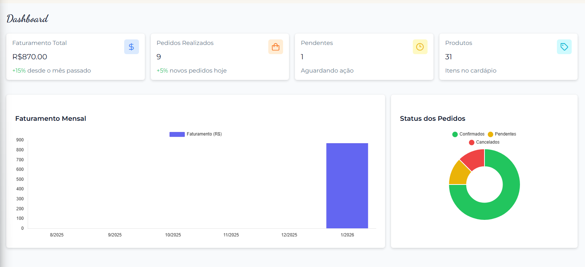 | 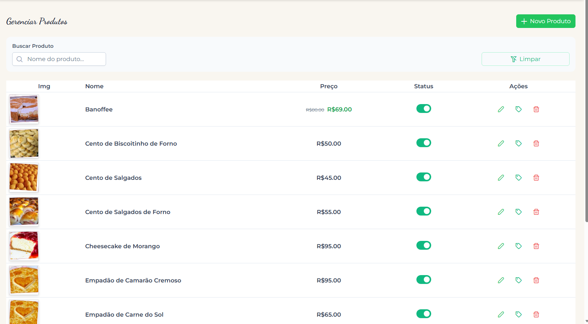 |

| Lista de Encomendas | Detalhes da Encomenda |
|:---:|:---:|
| 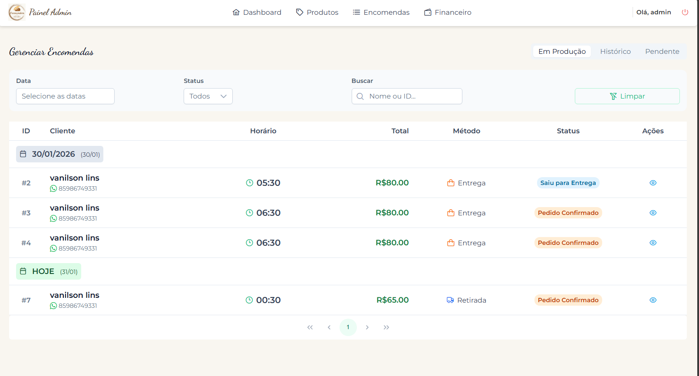 | 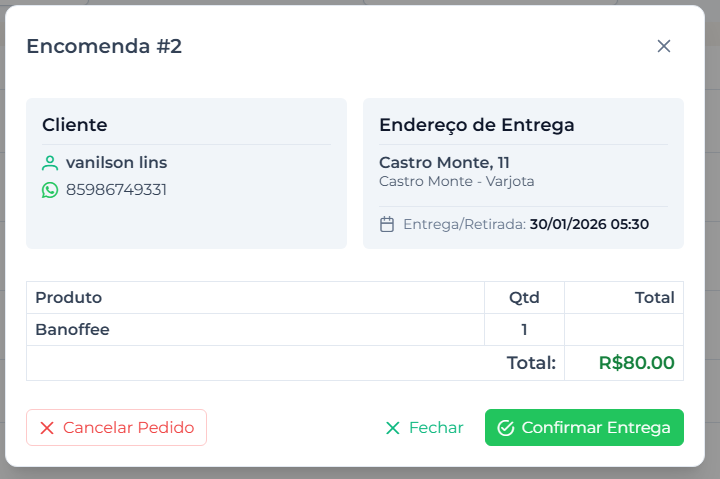 |

| Controle Financeiro | Detalhe da Transação |
|:---:|:---:|
| 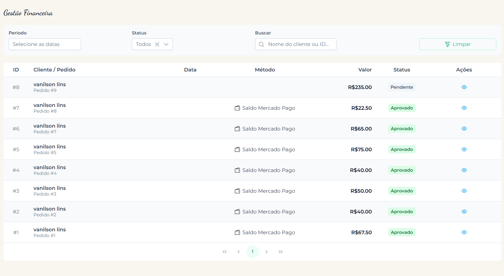 | 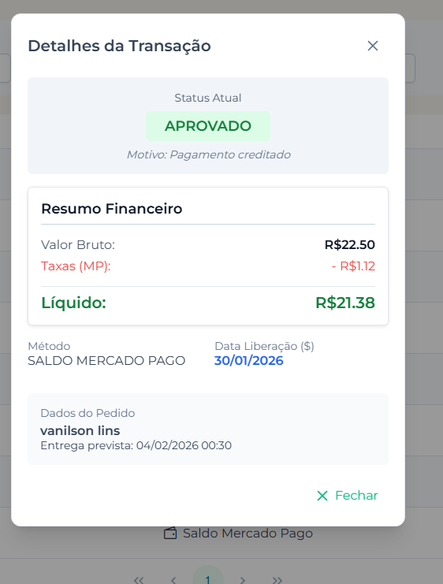 |

### 📦 Acompanhamento e Notificações (WhatsApp)

| Histórico de Pedidos (Web) | Notificações em Tempo Real (WhatsApp) |
|:---:|:---:|
| 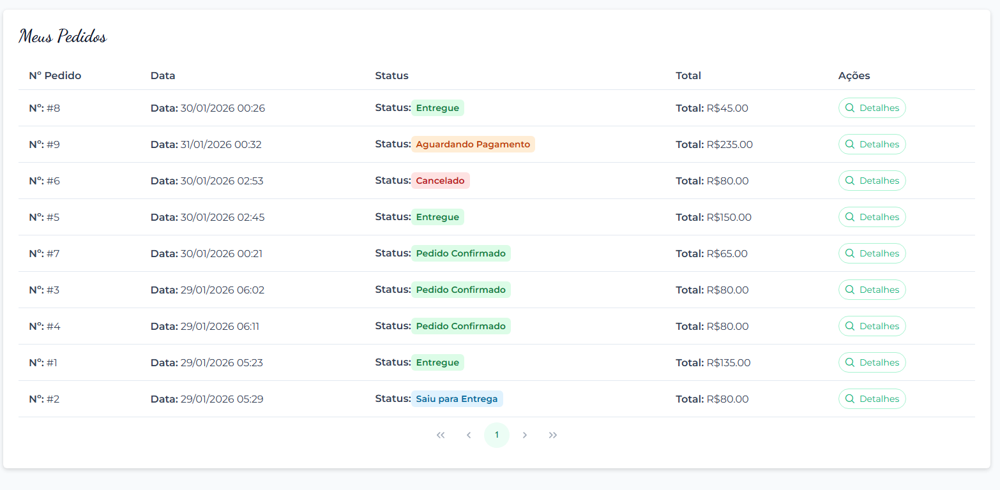 | 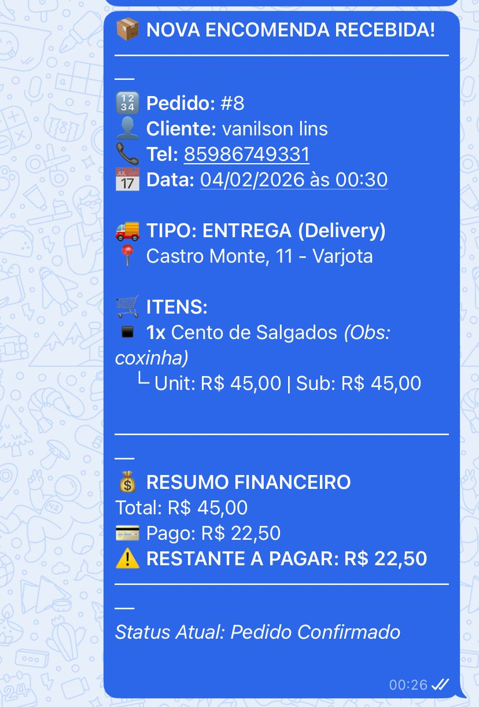  |

## 🧪 Como Testar o Projeto

Este projeto está hospedado em ambiente de produção utilizando serviços em nuvem. A arquitetura de serviços engloba:
1. **API Principal** (.NET 9) rodando no Render
2. **Auth0** (Gerenciamento de Identidade em Nuvem)
3. **Evolution API** (Envio de WhatsApp)

> 💡 **Performance e Status dos Servidores (Keep-Alive):**
> Para garantir a melhor experiência, implementamos uma rotina automatizada de *Cron Jobs*. A API Principal permanece **100% acordada e sem lentidão de inicialização** de **segunda a quinta-feira**, cobrindo o horário operacional da padaria.
> 
> A **Evolution API** foi configurada para despertar de forma totalmente automática assim que o frontend recebe um acesso.
>
> ⚠️ **Acessos noturnos ou aos finais de semana:** Se você estiver testando o projeto fora do horário comercial programado, as instâncias gratuitas do Render estarão em modo de suspensão. O primeiro carregamento pode levar cerca de **50 segundos** enquanto as APIs realizam o *cold start*. Após esse tempo, o sistema operará com velocidade normal.

### Acessando a Aplicação

Não é necessário iniciar nenhum serviço manualmente. Basta acessar o link abaixo, aguardar o carregamento inicial e navegar pelas funcionalidades:

🚀 **[Acessar A Nossa Padaria (np-order.vercel.app)](https://np-order.vercel.app/)**

#### 🔑 Credenciais de Teste (Administrador)
Para acessar o Dashboard e testar as funcionalidades exclusivas de gestão (Backoffice), você pode realizar o login com o seu **Google** ou usar a conta administrativa de testes abaixo:
* **E-mail:** `admin@teste.com`
* **Senha:** `Admin123`

